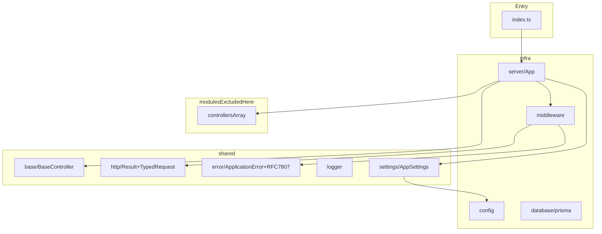

# API Skeleton Architecture (infra + shared)

This document describes a clean Node.js + Express API skeleton using the same pattern in this repository, focused on `src/infra` and `src/shared` (behavior summaries + selective snippets; open source files for full listings).

It intentionally excludes business modules. Modules are project-specific and should be implemented on top of this skeleton.

## Goals

- Keep a stable API bootstrap structure.
- Keep cross-cutting concerns in `infra` and `shared`.
- Keep business rules inside `modules` (not documented here).
- Keep integrations isolated via providers and services contracts.

## Folder Contract

```text
src/
├── index.ts
├── infra/
│   ├── config/
│   ├── database/
│   ├── middleware/      # auth, validation, handleError, logging (pino-http), …
│   └── server/
│       └── shutdown/    # graceful shutdown orchestration
├── modules/             # project-specific, excluded from this doc
└── shared/
    ├── base/
    ├── error/
    ├── http/
    ├── logger/
    ├── providers/
    ├── schemas/
    ├── services/
    ├── settings/
    ├── types/
    └── utils/
```



## Runtime Flow

- `src/index.ts` bootstraps dotenv, optional New Relic in production, `App` construction, HTTP `server` handle, and **graceful shutdown** (`ShutdownOrchestrator` on `SIGTERM` / `SIGINT`, plus fatal hooks).
- `module-alias/register` loads from compiled output only when running under `build/` (see source).
- `src/infra/server/App.ts` initializes settings, middleware stack, controllers, **404 → ApplicationError**, then global error handler.
- Middleware order (high level): `helmet` → **`pino-http` request logger** (`requestLogger`) → JSON body → **CORS** (allowed origins from `AppSettings.ServerOrigins`).
- Controllers (from `src/modules/index.ts`) are mounted under `AppSettings.ServerRoot` (e.g. `/api`).
- Input middleware (`validate`, `TokenClaims`) runs before handlers where configured.
- Success path: handlers return `Result<T>`; `BaseController.handleResult` sends **JSON** `result.toResultDto()`.
- Failure path: `next(error)` → `handleError` returns **`application/problem+json`** (RFC 7807-style body), not `Result`.
- Operational docs: [ERROR_HANDLING_GUIDE.md](../ERROR_HANDLING_GUIDE.md) at repo root.

## Modules Boundary (excluded)

`src/modules/index.ts` exports `controllers: BaseController[]`.  
Feature modules are not part of this skeleton doc by design.

## Config callout

This template’s **checked-in** config is intentionally small: `Environment`, `server` (`Root`, `Host`, `Port`, `Origins`), and `monitoring` flags. See `src/infra/config/index.ts` and `src/shared/settings/AppSettings.ts`.

When you grow the product, add keys there and extend `initAppSettings` — do not scatter `process.env` reads across modules.

---

## Base file reference — `src/index.ts` + `src/infra`

Source of truth is always the repo; below is a **behavior summary** plus small excerpts so this doc does not drift again.

### `src/index.ts` (bootstrap + shutdown)

- `dotenv.config()` at top.
- Optional `newrelic` when `IS_MONITORING_ENABLED` + production.
- `module-alias/register` only when `__filename` contains `build/` (compiled runtime).
- `const server = app.start()` then `ShutdownOrchestrator` + process signal / fatal handlers.

### `src/infra/config/index.ts`

- Typed `AppConfig`: `Environment`, `server` (`Root`, `Host`, `Port`, `Origins`), `monitoring` (`enabled`, `licenseKey`).

### `src/infra/database/prisma.ts`

- `PrismaClient` from generated client path under `infra/database/generated`.
- `@prisma/adapter-pg` + `DATABASE_URL` required at startup.

### `src/infra/server/App.ts`

- `initAppSettings(config)` in `setup()`.
- Middleware: `helmet` → `requestLogger` (`pino-http`) → JSON body → CORS (whitelist from `AppSettings.ServerOrigins`).
- Controllers mounted at `AppSettings.ServerRoot`.
- **404**: `loadNotFoundHandler` calls `next(HandlerErrorMiddleware.buildNotFoundError(...))`.
- **Errors**: `app.use(HandlerErrorMiddleware.handler)` — handler is a **class field arrow** so Express does not lose `this`.

### `src/infra/server/core/Server.ts` + `Modules.ts`

- Thin re-exports of Express `Application`, `Router`, `json` body parser, types.

### `src/shared/types/express.d.ts` (Request augmentation)

- `claims?`, `file?`, `log?` (`pino` `Logger`) on `Express.Request`.

### `src/infra/middleware/logging/requestLogger.ts`

- `pino-http` with `genReqId` / `x-request-id`, custom serializers safe when `req.socket` is missing (`socket?.remoteAddress ?? req.ip`).

### `src/infra/middleware/handleError/index.ts`

- Maps `Error` → RFC 7807-style **`ProblemDetails`** JSON, `Content-Type: application/problem+json`.
- Uses `ApplicationError` / `ValidationError`; unknown errors → generic 500 body (no stack leak in response).
- Logging: `req.log ?? logger.child({ requestId, context: 'error_middleware' })` so errors never assume `pino-http` ran.
- `headersSent`: `next(err)` (not `next(result)`).

### `src/infra/middleware/validation/zod/index.ts`

- `schema: ZodType`; on `ZodError` → `next(new ValidationError(messages))` (no inline `Result` response).
- Request typed as `Request & { file?: unknown }` for optional multipart `file`.

### `src/infra/middleware/authorization/Jwt/index.ts`

- **`jsonwebtoken.verify`** with `JWT_SECRET` (not decode-only).
- `ApplicationError` uses **object constructor** (`title`, `detail`, `status`, `code`, `type`, …).

### Health (module, not infra-only)

- `src/modules/Health/Health.controller.ts`: `GET .../health/live`, `GET .../health/ready` (readiness flips on graceful shutdown via `shutdownState`).

---

## Base File Code - `src/shared` (skeleton only)

### `src/shared/base/BaseController.ts`

- Builds `router`, logs controller init, emits monitoring custom event.
- `handleResult` uses **`res.req?.log ?? root logger`** for structured warn on failed `Result`, then `res.status(...).json(result.toResultDto())` for **success JSON envelope** (not RFC7807; errors from `next(err)` use global handler).

### `src/shared/http/Result.ts`

```typescript
export class ResultDto {
  message: string;
  error: string | string[];
  data: unknown;
  statusCode: number;
  success: boolean;
}

export interface IResult<T> {
  data: T;
  statusCode: number | string;
  success: boolean;
  message: string;
  error: string | string[];
  setData(data: T, statusCode: number | string): void;
  setData(data: T, statusCode: number | string, message: string): void;
  setStatusCode(statusCode: number | string, success: boolean): void;
  setError(error: string, statusCode: number | string): void;
  setMessage(message: string, statusCode: number | string): void;
  toResultDto(): ResultDto;
}

export class Result<T> implements IResult<T> {
  data: T;
  statusCode: number | string;
  success = true;
  message: string;
  error: string | string[];

  constructor() {}

  setData(data: T, statusCode: number | string, message?: string): void {
    this.data = data;
    this.statusCode = statusCode;

    if (message) this.message = message;
  }

  setStatusCode(statusCode: number | string, success: boolean): void {
    this.statusCode = statusCode;
    this.success = success;
  }

  setMessage(message: string, statusCode: number | string): void {
    this.message = message;
    this.statusCode = statusCode;
  }

  setError(error: string | string[], statusCode: number | string): void {
    this.success = false;
    this.error = error;
    this.statusCode = statusCode;
  }

  toResultDto(): ResultDto {
    return {
      statusCode: +this.statusCode,
      success: this.success,
      data: this.data,
      error: this.error,
      message: this.message,
    };
  }
}
```

### `src/shared/http/TypedRequest.ts`

- Infers `params` / `body` / `query` from a Zod object schema (4th `Request` generic is **not** `file`; upload typing uses `Request & { file?: unknown }` in validate middleware).
- Intersects `claims?: TokenPayloadDto` for handlers behind `TokenClaims`.

### `src/shared/http/ApplicationStatusCodes.ts`

```typescript
export default {
  SUCCESS: '200',
  CREATED: '201',
  NO_CONTENT: '204',
  BAD_REQUEST: '400',
  NOT_FOUND: '404',
  INTERNAL_ERROR: '500',
  UNAUTHORIZED: '401',
};
```

### `src/shared/error/ApplicationError.ts`

- Structured operational error: `title`, `detail`, `status`, `code`, optional `type`, `instance`, `cause`, `isOperational`.
- `errorCode` mirrors HTTP `status` for compatibility with older call sites.

### `src/shared/error/RepositoryError.ts`

- Extends `ApplicationError` with repository-specific `code` / `type` (maps infra failures to HTTP 500 class errors).

### `src/shared/logger/*`

- **`src/shared/logger/index.ts`**: single **Pino** root logger (`LOG_LEVEL`, JSON prod vs `pino-pretty` in development, redaction paths). Import `@/shared/logger` everywhere (no separate dev/prod Winston files).

### `src/shared/settings/AppSettings.ts`

- Mutable settings object + `initAppSettings(config: AppConfig)` (not a static class): `Environment`, `ServerPort`, `ServerHost`, `ServerOrigins`, `ServerRoot`.

### `src/shared/types/tokenPayload.ts`

```typescript
export type TokenPayloadDto = {
  id: string;
  profileId: string;
  clientId: string;
  organizationId: number;
  iat?: number;
  exp?: number;
};
```

### `src/shared/schemas/BaseGetSchema.schema.ts`

```typescript
import { z } from 'zod';

export const BasePaginatedGetSchema = z.object({
  query: z.object({
    page: z.coerce
      .number({
        invalid_type_error: 'Página deve ser um número',
        description: 'property "page"',
      })
      .int()
      .min(0, 'Página deve ser pelo menos 0')
      .optional(),
    limit: z.coerce
      .number({
        invalid_type_error: 'Limite deve ser um número',
        description: 'property "limit"',
      })
      .int()
      .min(1, 'Limite deve ser pelo menos 1')
      .optional(),
    query: z
      .string({
        invalid_type_error: 'Query deve ser uma string',
      })
      .optional(),
    sort: z
      .string({
        invalid_type_error: 'Sort deve ser uma string',
      })
      .optional(),
    order: z
      .string({
        invalid_type_error: 'Order deve ser uma string',
      })
      .optional(),
  }),
});
```

### `src/shared/types/pagination.ts`

```typescript
export type BasePaginationResult<T> = {
  results: T[];
  total: number;
  page: number;
  limit: number;
};

export type BasePaginationParams = {
  page?: number;
  limit?: number;
};

export type BasePaginationWithOffsetParams = {
  page: number;
  limit: number;
  offset: number;
};
```

### `src/shared/utils/pagination.ts`

```typescript
import { BasePaginationParams, BasePaginationWithOffsetParams } from '@/shared/types/pagination';

export const getPaginationParams = (params: BasePaginationParams): BasePaginationWithOffsetParams => {
  const page = params.page || 1;
  const limit = params.limit || 10;

  const offset = (page - 1) * limit;

  return {
    page,
    limit,
    offset,
  };
};
```

---

## Providers: Why and How (no project-specific implementation code)

### Why create a provider

- Isolates external vendor SDKs from business code.
- Makes testing easier with interface-based mocks.
- Prevents SDK usage spreading across controllers/use cases.
- Enables swap from one vendor to another with minimal changes.

### How to create a provider in this pattern

1. Create a contract interface:
   - `src/shared/providers/<ProviderName>/I<ProviderName>.ts`
2. Create one or more implementations:
   - `src/shared/providers/<ProviderName>/<ImplementationName>/index.ts`
3. Export a default singleton where globally shared:
   - Used by middleware/controller base when cross-cutting.
4. Depend on interface in consumers whenever possible.

### Monitoring coupling in current skeleton

Monitoring hooks (`monitoring.noticeError`, `recordCustomEvent`, `recordMetric`) are used from:

- `src/infra/middleware/handleError/index.ts`
- `src/shared/base/BaseController.ts`
- `src/infra/server/shutdown/orchestrator.ts` (shutdown lifecycle event)

Optional **New Relic** agent is loaded from `src/index.ts` when enabled; logging is **Pino** (no Winston enricher pipeline).

---

## Services: Why and How (no project-specific implementation code)

### Why create a shared service

- Centralizes HTTP communication with internal/external APIs.
- Encapsulates request/response mapping and retry/error policies.
- Exposes stable contracts to use cases (`IResult`, typed DTOs).

### How to create a service in this pattern

1. Contract:
   - `src/shared/services/<ServiceName>/I<ServiceName>Service.ts`
2. DTO and payload types:
   - `src/shared/services/<ServiceName>/types/index.ts`
3. HTTP client and concrete calls:
   - `src/shared/services/<ServiceName>/http/index.ts`
   - `src/shared/services/<ServiceName>/http/axios.ts`
4. Read base URL and credentials from config/settings.
5. Inject service into use cases rather than calling axios directly from module code.

---

## Tooling + Dependency Checklist

### Path aliases and module resolution

- `tsconfig.json` path aliases:
  - `@/shared/*`
  - `@/modules/*`
  - `@/infra/*`
- Runtime alias support:
  - `module-alias/register` when running compiled output from `build/` (see `src/index.ts`)
  - `_moduleAliases` in `package.json` for build output

### Core dependencies for this skeleton

- `express`, `cors`, `helmet`
- `dotenv`
- `zod`
- `pino`, `pino-http` (+ `pino-pretty` dev)
- `jsonwebtoken` (JWT verify in `TokenClaims`)
- `module-alias`
- `@prisma/client`, `prisma`, `@prisma/adapter-pg`, `pg`

### Optional dependencies

- `newrelic` (APM; loaded only when configured)

Use optional deps only when the integration is required.

---

## Prisma Note

`src/infra/database/prisma.ts` exports a single `PrismaClient` (with **Pg adapter** + `DATABASE_URL`) to be shared by repositories. Graceful shutdown calls `prisma.$disconnect()` from `ShutdownOrchestrator`.
