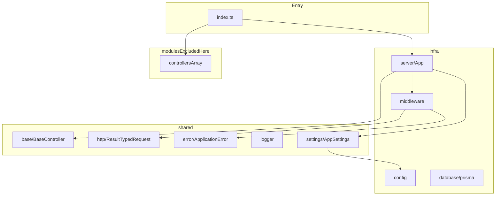

# API Skeleton Architecture (infra + shared)

This document describes a clean Node.js + Express API skeleton using the same pattern in this repository, focused on `src/infra` and `src/shared`.

It intentionally excludes business modules. Modules are project-specific and should be implemented on top of this skeleton.

## Goals

- Keep a stable API bootstrap structure.
- Keep cross-cutting concerns in `infra` and `shared`.
- Keep business rules inside `modules` (not documented here).
- Keep integrations isolated via providers and services contracts.

## Folder Contract

```text
src/
├── index.ts
├── infra/
│   ├── config/
│   ├── database/
│   ├── middleware/
│   └── server/
├── modules/             # project-specific, excluded from this doc
└── shared/
    ├── base/
    ├── error/
    ├── http/
    ├── logger/
    ├── providers/
    ├── schemas/
    ├── services/
    ├── settings/
    ├── types/
    └── utils/
```



## Runtime Flow

- `src/index.ts` bootstraps monitoring (optional), alias support, and app startup.
- `src/infra/server/App.ts` initializes settings, middleware, routes, and global error handler.
- Controllers (from `src/modules/index.ts`) are mounted under `AppSettings.ServerRoot`.
- Input middleware (`validate`, `TokenClaims`) runs before handlers.
- Handlers return `Result<T>`, then `BaseController.handleResult` standardizes responses.
- Unhandled errors go through `src/infra/middleware/handleError/index.ts`.

## Modules Boundary (excluded)

`src/modules/index.ts` exports `controllers: BaseController[]`.  
Feature modules are not part of this skeleton doc by design.

## Config Callout (minimal vs product-specific)

Current config/settings include product-specific keys (Azure storage, Redis, internal services URLs, encryption, monitoring).

For a clean new API:

- Keep minimum: `Environment`, `server.Host`, `server.Port`, `server.Root`.
- Keep `AppSettings.init(config)` pattern.
- Remove non-needed keys from both `src/infra/config/index.ts` and `src/shared/settings/AppSettings.ts`.
- Add only keys required by your new providers/services.

---

## Base File Code - `src/index.ts`

### `src/index.ts`

```typescript
if (process.env.IS_MONITORING_ENABLED === 'true' && process.env.ENVIRONMENT === 'production') {
  require('newrelic');
}

import 'module-alias/register';

import App from '@/infra/server/App';
import { controllers } from './modules';

const app = new App(controllers);

app.start();
```

---

## Base File Code - `src/infra`

### `src/infra/config/index.ts`

```typescript
import * as dotenv from 'dotenv';

dotenv.config();

const dev = 'development';

export default {
  Environment: process.env.ENVIRONMENT || dev,
  server: {
    Root: process.env.SERVER_ROOT || '/api',
    Host: process.env.SERVER_HOST || 'localhost',
    Port: process.env.PORT || 5003,
    Origins: process.env.ORIGINS || 'http://localhost:3000,http://localhost:3001,http://localhost:3002',
  },
  params: {
    envs: {
      dev: 'development',
      staging: 'staging',
      production: 'production',
    },
    storage: {
      azure: {
        ConnectionString: process.env.AZURE_STORAGE_CONNSTR,
        Url: process.env.AZURE_STORAGE_URL,
      },
    },
    services: {
      NotificationApiUrl: process.env.NOTIFICATION_API_URL,
      IntegrationApiUrl: process.env.INTEGRATION_API_URL,
      IdentityApiUrl: process.env.IDENTITY_API_URL,
    },
    encryption: {
      enabled: process.env.ENCRYPTION_ENABLED === 'true',
      key: process.env.ENCRYPTION_KEY,
      hashKey: process.env.HASH_KEY,
    },
  },
  redis: {
    host: process.env.REDIS_HOST || 'localhost',
    port: parseInt(process.env.REDIS_PORT || '6379'),
    password: process.env.REDIS_PASSWORD,
  },
  monitoring: {
    enabled: process.env.IS_MONITORING_ENABLED === 'true',
    licenseKey: process.env.NEW_RELIC_LICENSE_KEY,
  },
};
```

### `src/infra/database/prisma.ts`

```typescript
import { PrismaClient } from '@prisma/client';

export const prisma = new PrismaClient();
```

### `src/infra/server/App.ts`

```typescript
import cors from 'cors';
import helmet from 'helmet';

import { Server, Application, BodyParser } from './core/Modules';

import HandlerErrorMiddleware from '../middleware/handleError';

import config from '../config';

import logger from '@/shared/logger';
import AppSettings from '@/shared/settings/AppSettings';
import BaseController from '@/shared/base/BaseController';

export default class App {
  public app: Application;

  constructor(controllers: BaseController[]) {
    this.setup();
    this.app = Server();
    this.app.set('trust proxy', true);
    this.loadMiddleware();
    this.loadControllers(controllers);
    this.loadErrorHandler();
  }

  public loadMiddleware(): void {
    this.app.use(helmet());
    this.app.use(BodyParser({ limit: '50mb' }));
    this.app.use(cors());
  }

  private loadControllers(controllers: BaseController[]): void {
    controllers.forEach((controller) => {
      this.app.use(AppSettings.ServerRoot, controller.router);
    });
  }

  private loadErrorHandler(): void {
    this.app.use(HandlerErrorMiddleware.handler);
  }

  private setup(): void {
    AppSettings.init(config);
  }

  public listen(): void {
    this.app.listen(config.server.Port, () => {
      logger.info(`Server running on ${AppSettings.ServerHost}:${AppSettings.ServerPort}${AppSettings.ServerRoot}`);
    });
  }

  private runServices(): void {
    this.listen();
  }

  public start(): void {
    this.runServices();
  }
}
```

### `src/infra/server/core/Server.ts`

```typescript
import Server from 'express';

const Router = Server.Router;

export { Router as RouterType, json as BodyParser } from 'express';

export type { Response, NextFunction, Application } from 'express';

export { Server, Router };
```

### `src/infra/server/core/Modules.ts`

```typescript
export { Server, BodyParser, Router, RouterType } from './Server';

export type { Response, NextFunction, Application } from './Server';
```

### `src/infra/server/core/types/express/index.d.ts`

```typescript
import { TokenPayloadDto } from '@/shared/types/tokenPayload';

declare module 'express-serve-static-core' {
  interface Request {
    claims: TokenPayloadDto;
  }
}
```

### `src/infra/middleware/handleError/index.ts`

```typescript
import { NextFunction, Request, Response } from 'express';

import logger from '@/shared/logger';
import { Result } from '@/shared/http/Result';
import { ApplicationError } from '@/shared/error/ApplicationError';
import { monitoring } from '@/shared/providers/MonitoringHandler/NewRelic';

class HandlerErrorMiddleware {
  public handler(err: ApplicationError, req: Request, res: Response, next: NextFunction): void {
    const result = new Result();

    monitoring.noticeError(err, {
      url: req.url,
      method: req.method,
      statusCode: err.errorCode,
      userAgent: req.get('User-Agent'),
      ip: req.ip
    });

    if (err?.name === 'ApplicationError') {
      result.setError(err.message, err.errorCode);
      logger.warn('Application Error', {
        error: err.message,
        code: err.errorCode,
        url: req.url,
        method: req.method
      });
    } else {
      logger.error('Unexpected Error', {
        error: err.message,
        stack: err.stack,
        url: req.url,
        method: req.method
      });
      result.setError('SOMETHING_WENT_WRONG', 500);
    }

    if (res.headersSent) {
      return next(result);
    }

    res.status(+result.statusCode).send(result);
  }
}

export default new HandlerErrorMiddleware();
```

### `src/infra/middleware/validation/index.ts`

```typescript
import { validate } from './zod';

export { validate };
```

### `src/infra/middleware/validation/zod/index.ts`

```typescript
import { NextFunction } from 'express';
import { AnyZodObject, ZodError, ZodType, ZodTypeDef } from 'zod';

import { Result } from '@/shared/http/Result';

export const validate =
  <T extends ZodType<any, ZodTypeDef, any>>(schema: AnyZodObject) =>
  async (req: any, res: any, next: NextFunction) => {
    const result = new Result();
    try {
      const validationResult = await schema.parseAsync({
        body: req.body,
        query: req.query,
        params: req.params,
        file: req.file,
      });

      req.body = validationResult.body;
      req.query = validationResult.query;
      req.params = validationResult.params;
      req.file = validationResult.file;

      return next();
    } catch (error: any) {
      if (error instanceof ZodError) {
        result.setError(
          error.errors.map((e) => e.message),
          400,
        );
        res.status(+result.statusCode).send(result);
      } else {
        next(error);
      }
    }
  };
```

### `src/infra/middleware/authorization/index.ts`

```typescript
import { TokenClaims } from './Jwt';

export { TokenClaims };
```

### `src/infra/middleware/authorization/Jwt/index.ts`

```typescript
import { jwtDecode } from 'jwt-decode';
import { NextFunction, Response, Request } from 'express';

import { ApplicationError } from '@/shared/error/ApplicationError';
import ApplicationStatusCodes from '@/shared/http/ApplicationStatusCodes';

export const TokenClaims = (req: Request, _: Response, next: NextFunction) => {
  try {
    const token = req.headers.authorization;

    if (!token)
      throw new ApplicationError(
        'The resource you are trying to access is protected. No authorization token was provided.',
        ApplicationStatusCodes.UNAUTHORIZED,
      );

    const tokenParts = token.split(' ');

    if (tokenParts.length !== 2)
      throw new ApplicationError(
        'The authorization token is invalid. Please provide a valid token.',
        ApplicationStatusCodes.UNAUTHORIZED,
      );

    if (tokenParts[0] !== 'Bearer')
      throw new ApplicationError(
        'The authorization token is invalid. Please provide a valid token.',
        ApplicationStatusCodes.UNAUTHORIZED,
      );

    req.claims = jwtDecode(tokenParts[1]);

    next();
  } catch (error) {
    throw new ApplicationError(
      'The authorization token is invalid. Please provide a valid token.',
      ApplicationStatusCodes.UNAUTHORIZED,
    );
  }
};
```

---

## Base File Code - `src/shared` (skeleton only)

### `src/shared/base/BaseController.ts`

```typescript
import { Router, RouterType, Response } from '@/infra/server/core/Modules';
import { IResult } from '@/shared/http/Result';
import logger from '@/shared/logger';
import { monitoring } from '@/shared/providers/MonitoringHandler/NewRelic';

export default class BaseController {
  public router: RouterType;

  constructor(name: string) {
    this.router = Router();
    logger.info(`${name} Controller initialized`);

    monitoring.recordCustomEvent('ControllerInitialized', {
      controllerName: name
    });
  }

  handleResult(res: Response, result: IResult<any>): void {
    monitoring.recordMetric('Custom/API/Response', 1);
    monitoring.recordMetric(`Custom/API/Response/${result.success ? 'Success' : 'Error'}`, 1);

    if (!result.success) {
      logger.warn('API Response Error', {
        statusCode: result.statusCode,
        error: result.message,
        url: res.req?.url,
        method: res.req?.method
      });
    }

    res.status(+result.statusCode).json(result.toResultDto());
  }
}
```

### `src/shared/http/Result.ts`

```typescript
export class ResultDto {
  message: string;
  error: string | string[];
  data: unknown;
  statusCode: number;
  success: boolean;
}

export interface IResult<T> {
  data: T;
  statusCode: number | string;
  success: boolean;
  message: string;
  error: string | string[];
  setData(data: T, statusCode: number | string): void;
  setData(data: T, statusCode: number | string, message: string): void;
  setStatusCode(statusCode: number | string, success: boolean): void;
  setError(error: string, statusCode: number | string): void;
  setMessage(message: string, statusCode: number | string): void;
  toResultDto(): ResultDto;
}

export class Result<T> implements IResult<T> {
  data: T;
  statusCode: number | string;
  success = true;
  message: string;
  error: string | string[];

  constructor() {}

  setData(data: T, statusCode: number | string, message?: string): void {
    this.data = data;
    this.statusCode = statusCode;

    if (message) this.message = message;
  }

  setStatusCode(statusCode: number | string, success: boolean): void {
    this.statusCode = statusCode;
    this.success = success;
  }

  setMessage(message: string, statusCode: number | string): void {
    this.message = message;
    this.statusCode = statusCode;
  }

  setError(error: string | string[], statusCode: number | string): void {
    this.success = false;
    this.error = error;
    this.statusCode = statusCode;
  }

  toResultDto(): ResultDto {
    return {
      statusCode: +this.statusCode,
      success: this.success,
      data: this.data,
      error: this.error,
      message: this.message,
    };
  }
}
```

### `src/shared/http/TypedRequest.ts`

```typescript
/* eslint-disable @typescript-eslint/no-explicit-any */
import { Request, RequestHandler } from 'express';
import { z, ZodType, ZodTypeDef, ZodObject } from 'zod';

export type RouteHandler = RequestHandler<any, any, any, any, Record<string, any>>;

type ExtractSchema<T> = T extends ZodObject<infer U>
  ? { [K in keyof U]: U[K] extends ZodType<any, ZodTypeDef, any> ? U[K] : never }
  : never;

type ExtractableKeys = 'params' | 'body' | 'query' | 'file';
type FilterSchema<T> = Pick<T, ExtractableKeys & keyof T>;

export type TypedRequest<TSchema extends ZodType<any, ZodTypeDef, any>> = Request<
  z.infer<FilterSchema<ExtractSchema<TSchema>>['params']>,
  any,
  z.infer<FilterSchema<ExtractSchema<TSchema>>['body']>,
  z.infer<FilterSchema<ExtractSchema<TSchema>>['query']>,
  z.infer<FilterSchema<ExtractSchema<TSchema>>['file']>
>;
```

### `src/shared/http/ApplicationStatusCodes.ts`

```typescript
export default {
  SUCCESS: '200',
  CREATED: '201',
  NO_CONTENT: '204',
  BAD_REQUEST: '400',
  NOT_FOUND: '404',
  INTERNAL_ERROR: '500',
  UNAUTHORIZED: '401',
};
```

### `src/shared/error/ApplicationError.ts`

```typescript
export class ApplicationError extends Error {
  public constructor(message: string, errorCode: number | string, stack?: string) {
    super(message);
    this.name = 'ApplicationError';
    this.errorCode = errorCode;
    this.stack = stack;
  }
  errorCode: number | string;
}
```

### `src/shared/error/RepositoryError.ts`

```typescript
export class RepositoryError extends Error {
  public constructor(message: string) {
    super(message);
    this.name = 'RepositoryError';
  }
}
```

### `src/shared/logger/index.ts`

```typescript
import buildDevLogger from './logger.dev';
import buildProdLogger from './logger.prod';
import { Logger } from 'winston';

import dotenv from 'dotenv';
dotenv.config();

let logger: Logger;
let isDevEnvironment = process.env.ENVIRONMENT === 'development';

if (isDevEnvironment) logger = buildDevLogger;
else logger = buildProdLogger;

export default logger;
```

### `src/shared/logger/logger.dev.ts`

```typescript
import { format, createLogger, transports } from 'winston';

const { timestamp, combine, printf, errors, colorize } = format;

const buildDevLogger = () => {
  const logFormat = printf(({ level, message, timestamp, stack, ...meta }) => {
    return `${timestamp} ${level}: ${stack || message} ${Object.keys(meta).length > 0 ? JSON.stringify(meta) : ''}`;
  });

  return createLogger({
    format: combine(colorize(), timestamp({ format: 'YYYY-MM-DD HH:mm:ss' }), errors({ stack: true }), logFormat),
    transports: [new transports.Console()],
  });
};

export default buildDevLogger();
```

### `src/shared/logger/logger.prod.ts`

```typescript
import winston, { format, createLogger, transports } from 'winston';

const { timestamp, combine, errors, json, printf } = format;

const buildProdLogger = () => {
  const isMonitoringEnabled = process.env.IS_MONITORING_ENABLED === 'true';

  let logFormat;

  const errorObjectFormat = printf(({ level, message, timestamp, stack, ...meta }) => {
    return `${Object.keys(meta).length > 0 ? JSON.stringify(meta) : ''}`;
  });

  if (isMonitoringEnabled) {
    const newrelicFormatter = require('@newrelic/winston-enricher')(winston)
    logFormat = combine(
      timestamp(),
      errors({ stack: true }),
      newrelicFormatter(),
      json(),
      errorObjectFormat,
    );
  } else {
    logFormat = combine(
      timestamp(),
      errors({ stack: true }),
      json(),
      errorObjectFormat,
    );
  }

  return createLogger({
    format: logFormat,
    transports: [
      new transports.Console({
        level: 'info',
      })
    ]
  });
};

export default buildProdLogger();
```

### `src/shared/settings/AppSettings.ts`

```typescript
export default class AppSettings {
  static Environment: string;

  static ServerPort: string;
  static ServerHost: string;
  static ServerOrigins: string;
  static ServerRoot: string;

  static StorageConnectionString: string;
  static StorageUrl: string;

  static redis: {
    host: string;
    port: number;
    password?: string;
  };

  static init(config: { [key: string]: any }): void {
    this.Environment = config.Environment;

    this.ServerPort = config.server.Port;
    this.ServerHost = config.server.Host;
    this.ServerRoot = config.server.Root;
    this.ServerOrigins = config.server.Origins;

    this.StorageConnectionString = config.params.storage.azure.ConnectionString;
    this.StorageUrl = config.params.storage.azure.Url;

    this.redis = {
      host: config.redis?.host || 'localhost',
      port: config.redis?.port || 6379,
      password: config.redis?.password,
    };
  }
}
```

### `src/shared/types/tokenPayload.ts`

```typescript
export type TokenPayloadDto = {
  id: string;
  profileId: string;
  clientId: string;
  organizationId: number;
  iat?: number;
  exp?: number;
};
```

### `src/shared/schemas/BaseGetSchema.schema.ts`

```typescript
import { z } from 'zod';

export const BasePaginatedGetSchema = z.object({
  query: z.object({
    page: z.coerce
      .number({
        invalid_type_error: 'Página deve ser um número',
        description: 'property "page"',
      })
      .int()
      .min(0, 'Página deve ser pelo menos 0')
      .optional(),
    limit: z.coerce
      .number({
        invalid_type_error: 'Limite deve ser um número',
        description: 'property "limit"',
      })
      .int()
      .min(1, 'Limite deve ser pelo menos 1')
      .optional(),
    query: z
      .string({
        invalid_type_error: 'Query deve ser uma string',
      })
      .optional(),
    sort: z
      .string({
        invalid_type_error: 'Sort deve ser uma string',
      })
      .optional(),
    order: z
      .string({
        invalid_type_error: 'Order deve ser uma string',
      })
      .optional(),
  }),
});
```

### `src/shared/types/pagination.ts`

```typescript
export type BasePaginationResult<T> = {
  results: T[];
  total: number;
  page: number;
  limit: number;
};

export type BasePaginationParams = {
  page?: number;
  limit?: number;
};

export type BasePaginationWithOffsetParams = {
  page: number;
  limit: number;
  offset: number;
};
```

### `src/shared/utils/pagination.ts`

```typescript
import { BasePaginationParams, BasePaginationWithOffsetParams } from '@/shared/types/pagination';

export const getPaginationParams = (params: BasePaginationParams): BasePaginationWithOffsetParams => {
  const page = params.page || 1;
  const limit = params.limit || 10;

  const offset = (page - 1) * limit;

  return {
    page,
    limit,
    offset,
  };
};
```

---

## Providers: Why and How (no project-specific implementation code)

### Why create a provider

- Isolates external vendor SDKs from business code.
- Makes testing easier with interface-based mocks.
- Prevents SDK usage spreading across controllers/use cases.
- Enables swap from one vendor to another with minimal changes.

### How to create a provider in this pattern

1. Create a contract interface:
   - `src/shared/providers/<ProviderName>/I<ProviderName>.ts`
2. Create one or more implementations:
   - `src/shared/providers/<ProviderName>/<ImplementationName>/index.ts`
3. Export a default singleton where globally shared:
   - Used by middleware/controller base when cross-cutting.
4. Depend on interface in consumers whenever possible.

### Monitoring coupling in current skeleton

Current infra/shared base flow expects monitoring at three points:

- `src/infra/middleware/handleError/index.ts`
- `src/shared/base/BaseController.ts`
- `src/shared/logger/logger.prod.ts`

If a new project does not need New Relic, keep same import contract but provide a no-op implementation.

---

## Services: Why and How (no project-specific implementation code)

### Why create a shared service

- Centralizes HTTP communication with internal/external APIs.
- Encapsulates request/response mapping and retry/error policies.
- Exposes stable contracts to use cases (`IResult`, typed DTOs).

### How to create a service in this pattern

1. Contract:
   - `src/shared/services/<ServiceName>/I<ServiceName>Service.ts`
2. DTO and payload types:
   - `src/shared/services/<ServiceName>/types/index.ts`
3. HTTP client and concrete calls:
   - `src/shared/services/<ServiceName>/http/index.ts`
   - `src/shared/services/<ServiceName>/http/axios.ts`
4. Read base URL and credentials from config/settings.
5. Inject service into use cases rather than calling axios directly from module code.

---

## Tooling + Dependency Checklist

### Path aliases and module resolution

- `tsconfig.json` path aliases:
  - `@/shared/*`
  - `@/modules/*`
  - `@/infra/*`
- Runtime alias support:
  - `module-alias/register` in `src/index.ts`
  - `_moduleAliases` in `package.json` for build output

### Core dependencies for this skeleton

- `express`, `cors`, `helmet`
- `dotenv`
- `zod`
- `winston`
- `jwt-decode`
- `module-alias`
- `@prisma/client` + `prisma`

### Optional dependencies

- `newrelic`
- `@newrelic/winston-enricher`

Use these only if monitoring integration is required.

---

## Prisma Note

`src/infra/database/prisma.ts` exports a single `PrismaClient` instance to be shared by repositories.
